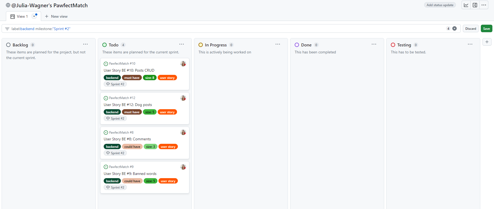

# **Agile Process**

[Go back to the README](README.md)

## **Table of Contents**

<!-- TOC -->
* [**Agile Process**](#agile-process)
  * [**Table of Contents**](#table-of-contents)
  * [**Methodology**](#methodology)
  * [**Sprints**](#sprints)
    * [**Sprint 1 (23.03. - 29.03.)**](#sprint-1-2303---2903)
    * [**Sprint 2 (30.03. - 05.04.)**](#sprint-2-3003---0504)
    * [**Sprint 3 (06.04. - 12.04.)**](#sprint-3-0604---1204)
    * [**Sprint 4 (13.04. - 19.04.)**](#sprint-4-1304---1904)
    * [**Sprint 5 (20.04. - 26.04.)**](#sprint-5-2004---2604)
    * [**Sprint 6 (27.04. - 03.05.)**](#sprint-6-2704---0305)
    * [**Sprint 7 (04.05. - 10.05.)**](#sprint-7-0405---1005)
    * [**Sprint 8 (11.05. - 17.05.)**](#sprint-8-1105---1705)
    * [**Sprint 9 (18.05. - 24.05.)**](#sprint-9-1805---2405)
    * [**Sprint 10 (25.05. - 31.05.)**](#sprint-10-2505---3105)
<!-- TOC -->

## **Methodology**

I used an agile approach to plan and work on my project. I decided to create one [GitHub projects board](https://github.com/users/Julia-Wagner/projects/4) that I use for both frontend and backend tasks. This way I have an overview of all user stories and can manage sprints and milestones for the whole project in one place.

I decided to group my features into **Epics** and create several **User Stories** for each epic. To prioritize the stories, I used **MoSCoW Prioritization**. To represent this in my Kanban board I created custom labels (*must have*, *should have*, *could have* and *won´t have*).

To have a better overview of issues on my board, I also created custom labels for the type of issue and for Story Points using the Fibonacci sequence.

\
*My custom labels*

I added all my user stories with the according epic, acceptance criteria and tasks in the description. I used **milestones** from the beginning to plan a MVP release and a final submission. I decided to start by putting all my user stories in the **Backlog** column of my board. To visualize my sprints, I will use milestones. At the beginning of each sprint, I will add the according issues to the current sprint milestone and move them to the **Todo** column.

\
*The initial setup of my Kanban board with all User Stories in the Backlog*

## **Sprints**

Below is a summary of each of my sprints. As described above, I am using milestones for sprints. To focus on the tasks of my current sprint, I am using a filter for the current milestone to only see the issues added to my current sprint.

### **Sprint 1 (23.03. - 29.03.)**

For my first sprint, I added a backend dev task, to set up the project. Additionally, I added three backend user stories with a total of **14 story points**.

\
*Start of Sprint 1*

I finished all the tasks planned for my first sprint. I also decided to deploy the API right away to Heroku, so I added an additional dev task for this.

\
*End of Sprint 1*

### **Sprint 2 (30.03. - 05.04.)**

I added four user stories with a total of **21 story points** for my second sprint. I have two *must have* and two *could have* user stories. As I am not sure yet how difficult it will be to create the dog posts and if I will still have time for the comments in this sprint.

\
*Start of Sprint 2*

I only finished one of the planned user stories for this sprint. I started the second *must have* story, but did not finish it completely as it was more complex than I originally thought. I will move all unfinished user stories to the backlog.

\
*End of Sprint 2*

### **Sprint 3 (06.04. - 12.04.)**

I decided to add the unfinished user stories from the last sprint with a total of **13 story points** for my next sprint.

\
*Start of Sprint 3*

I finished all planned user stories and added one *dev task* at the end as I still had time. I decided to create automated tests for all my existing apps. It was a good idea to do this early, as I found a few issues with the permissions with the automated tests.

\
*End of Sprint 3*

### **Sprint 4 (13.04. - 19.04.)**

For this sprint I added five user stories with a total of **16 story points**. I have two *new* user stories to implement and three stories that should already be covered by the existing functionality. These just need to be tested to make sure the acceptance criteria is met, so I just gave them one story point each.

\
*Start of Sprint 4*

I finished all planned user stories and added one more from the backlog. I managed to finish all *must have* and *should have* user stories for the backend. I also added the backend features and testing details to the readme. So for now I am finished with the backend part of the project.

\
*End of Sprint 4*

### **Sprint 5 (20.04. - 26.04.)**

For my first frontend sprint, I added two dev tasks, to set up and deploy the project. Additionally, I added two user stories with a total of **11 story points**.

\
*Start of Sprint 5*

I finished my planned dev tasks and user stories. As I still had time, I added one more use story. For this additional story I also found two bugs while testing. One was resolved immediately in this sprint. I added the other bug to the backlog.

\
*End of Sprint 5*

### **Sprint 6 (27.04. - 03.05.)**

For my next sprint, I added three user stories with a total of **16 story points**.

\
*Start of Sprint 6*

Two of my planned user stories are finished. For the third, I did not finish all tasks, so I am moving it back to the backlog for now. In addition to these three I fixed the bug from the last sprint.

\
*End of Sprint 6*

### **Sprint 7 (04.05. - 10.05.)**

For this sprint I added four user stories with a total of **21 story points**. I added more story points this time, as I noticed that I was doing more than I had planned in most of my sprints.

\
*Start of Sprint 7*

I underestimated the story points for these user stories. I managed to finish the biggest user story and started on the profile stories. The unfinished user stories are moved to the backlog again.

\
*End of Sprint 7*

### **Sprint 8 (11.05. - 17.05.)**

I decided to carry on with the three unfinished user stories for this sprint. They have a total of **13 story points**.

\
*Start of Sprint 8*

I finished all planned user stories and added the implemented features to the readme.

\
*End of Sprint 8*

### **Sprint 9 (18.05. - 24.05.)**

I added 5 user stories with a total of **19 story points** for this sprint. By the end of this sprint, the MVP with the basic functionality of this project should be done.

\
*Start of Sprint 9*

All planned user stories are finished and apart from testing and documentation the most important parts of the project are finished.

\
*End of Sprint 9*

### **Sprint 10 (25.05. - 31.05.)**

I added 4 user stories with a total of **26 story points** for this sprint.

\
*Start of Sprint 10*

I finished all planned user stories and many additional bugs. With this sprint, I managed to finish all *must have* and *should have* user stories.

To finish my project, I will test everything again thoroughly and complete documentation. But for these last steps I will not create another sprint.

\
*End of Sprint 10*

## **Conclusion**

Breaking the project down into epics and user stories, really thinking about them and adding acceptance criteria and tasks helped me get a better idea of the application from the beginning. Creating milestones and planning sprints was great to plan ahead and be able to estimate the duration of this project.

I have four **backend user stories** and five **frontend user stories** left, that I labelled as *won´t have* for now, as they are not necessary for the first release of the application.
