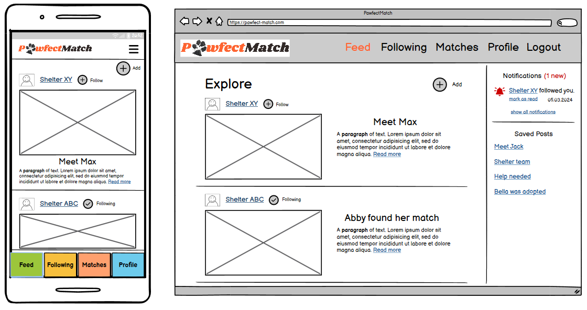
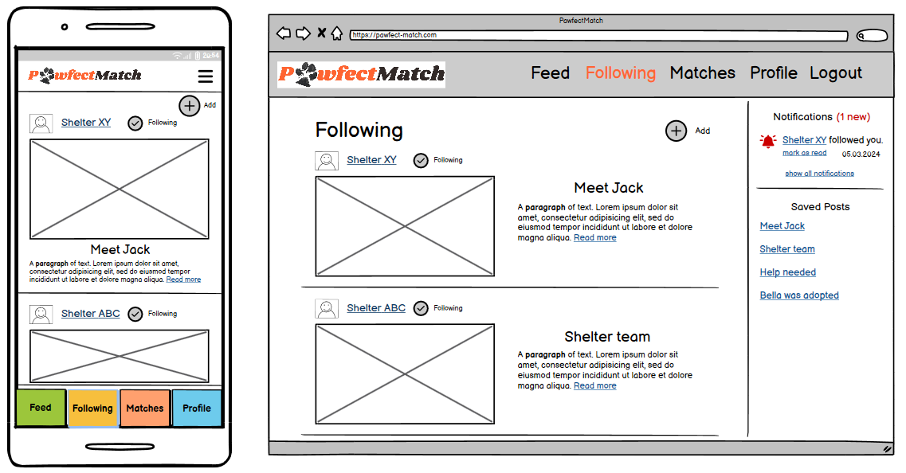
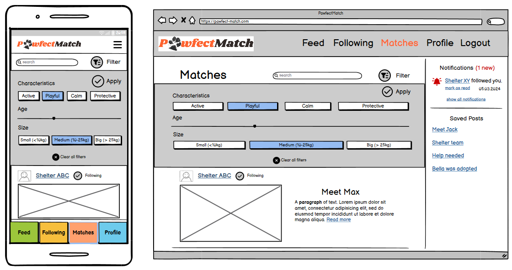
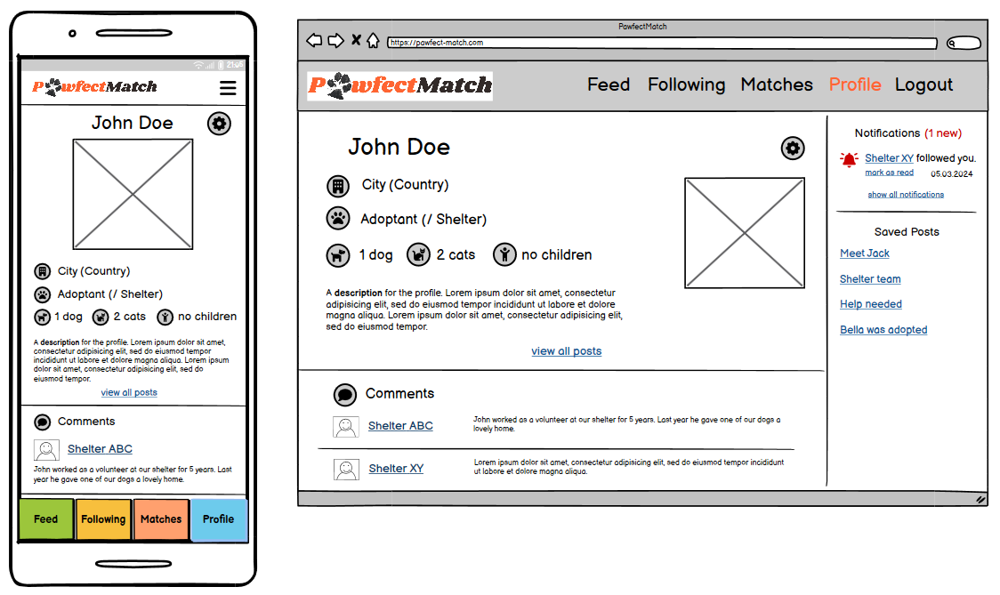
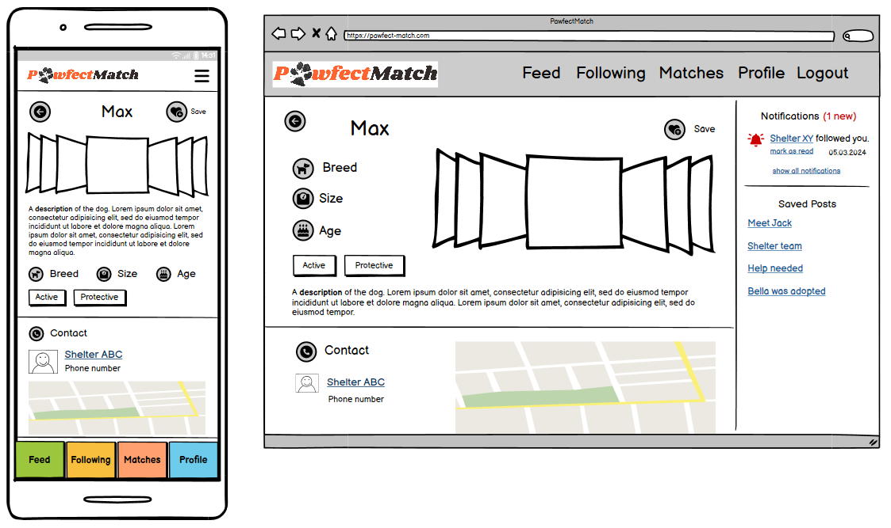
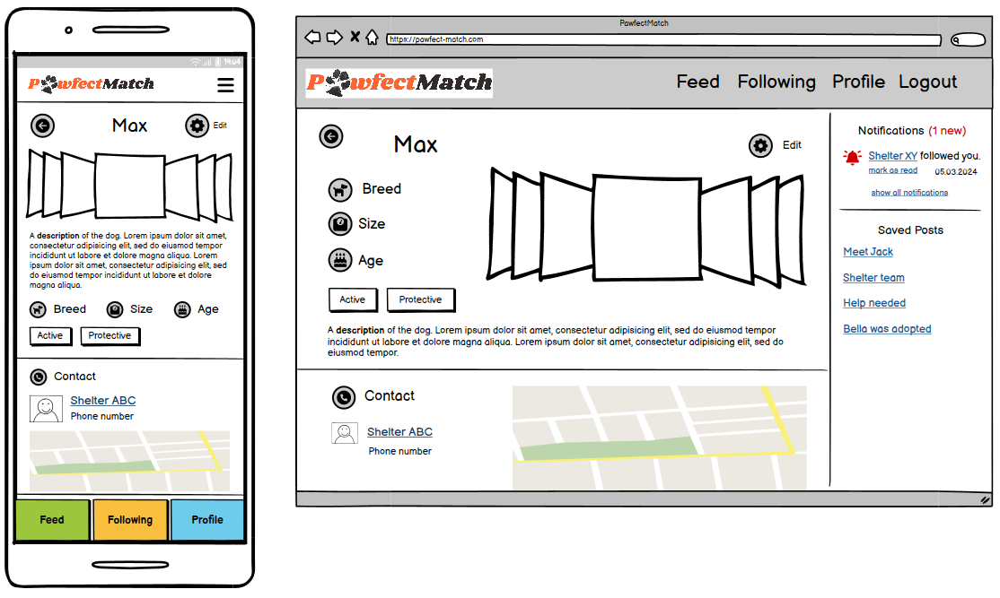
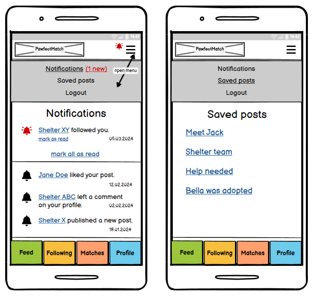
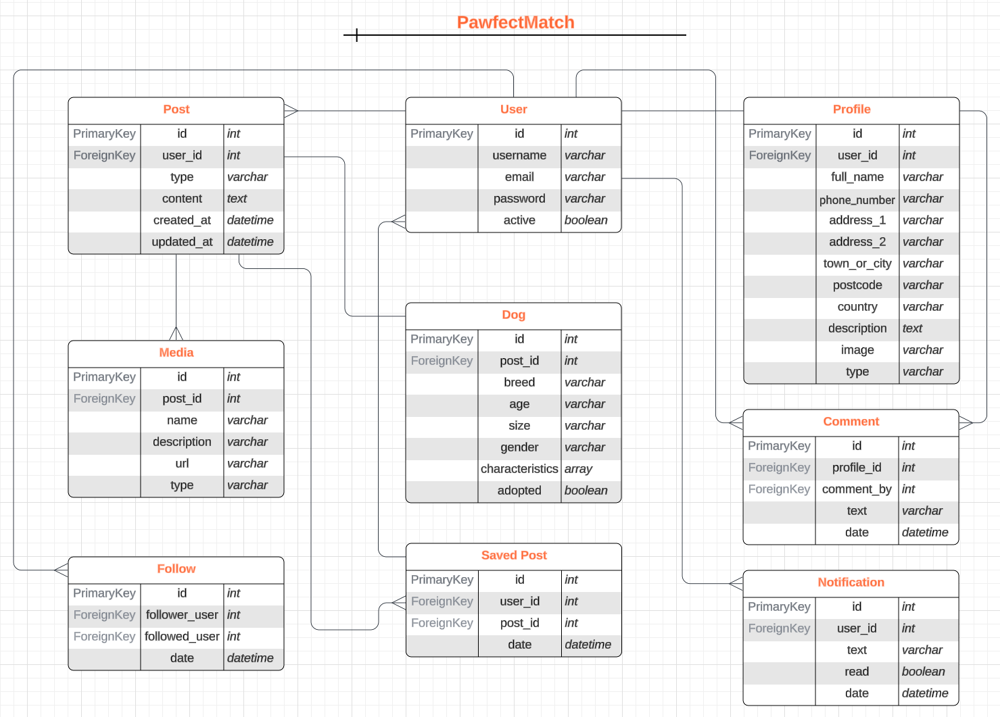
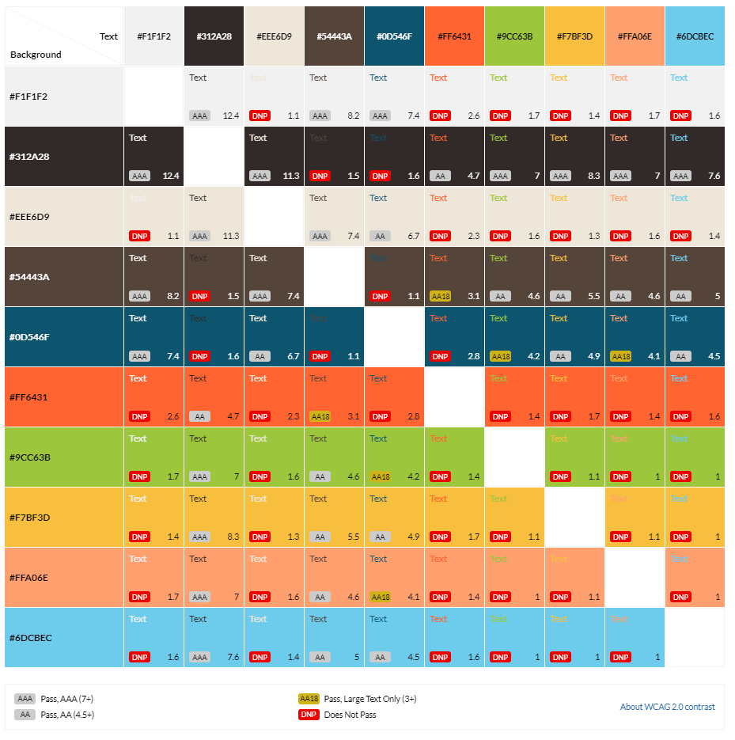
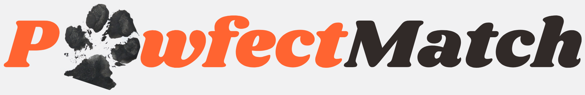

# **PawfectMatch**

PawfectMatch is a platform to connect shelters with loving homes for their dogs. Shelters can register and post their dogs, share stories and photos. Future dog owners can register to look for dogs.

# **Table of Contents**

<!-- TOC -->
* [**PawfectMatch**](#pawfectmatch)
* [**Table of Contents**](#table-of-contents)
* [**Planning**](#planning)
  * [**Strategy Plane**](#strategy-plane)
    * [**Target Audience**](#target-audience)
    * [**Site Goals**](#site-goals)
  * [**Scope Plane**](#scope-plane)
    * [**Necessary Features:**](#necessary-features)
    * [**Nice-to-have Features:**](#nice-to-have-features)
  * [**Structure Plane**](#structure-plane)
    * [**Epic: User Authentication**](#epic-user-authentication)
    * [**Epic: General UX**](#epic-general-ux)
    * [**Epic: Profile**](#epic-profile)
    * [**Epic: Posts**](#epic-posts)
    * [**Epic: Dog Posts**](#epic-dog-posts)
    * [**Epic: Notifications and Communication**](#epic-notifications-and-communication)
  * [**Skeleton Plane**](#skeleton-plane)
    * [**Wireframes**](#wireframes)
    * [**Database Schema**](#database-schema)
  * [**Surface Plane**](#surface-plane)
    * [**Design**](#design)
    * [**Colors and Fonts**](#colors-and-fonts)
    * [**Logo**](#logo)
* [**Credits**](#credits)
  * [**Content**](#content)
  * [**Media and Design**](#media-and-design)
<!-- TOC -->

# **Planning**

I structured my planning phase using the 5 UX planes - strategy, scope, structure, skeleton, and surface. The planning process was iterative. While gaining a better understanding of the project's scope, these planes evolved, creating a user-centered design for PawfectMatch.

## **Strategy Plane**

The idea for my PP5 is to create a platform to match shelter dogs with loving homes. Users can register as a shelter or adopter and find each other using filters.

### **Target Audience**

There are two target groups for this project with different needs and goals.

1. **Dog shelters** that want to use the application to find new homes for their dogs.
   - Shelters that want to reach more people and present themselves.
   - Shelters that want to have a point of reference for everyone interested in their dogs and adoption stories.
   - Shelters that want to find adopters based on the characteristics and needs of each dog.
2. **Individuals and families** that want to adopt a dog or are simply interested in dogs.
   - Adopters that are looking for a dog to adopt.
   - Adopters that want to have a closer look at a specific shelter before adopting a dog from them.
   - Dog lovers that are interested in the shelters work.
   - Dog lovers that want to read heartwarming stories about adopted dogs.

### **Site Goals**

- Build a platform for dog lovers.
- Connect shelters and adopters.
- Improve the adoption process by allowing to define criteria for each side.
  - Shelters can define the characteristics and needs for each dog.
  - Adopters give information about their housing situation and can look for dogs based on filters.
- Allow creating posts with multiple photos.
- Implement CRUD functionality.
- Make the application responsive, so it can be used on desktop, tablet and mobile screen sizes.

## **Scope Plane**

To get a better understanding of what the application will look like, I wrote down the features and sorted them into necessary and nice-to-have features.

### **Necessary Features:**

- Shelters can register and login. 
- Adopters can register and login. 
- Users (shelters and adopters) can fill out a profile. 
- Profiles can be edited. 
- Posts with pictures can be created, edited and deleted. 
- Posts for dogs get a special flag, to be able to filter for dogs. 
- Adopters can search and filter for dogs using characteristics and location. 
- Shelters can define characteristics for each dog. (breed, age, size,…)
- Dogs can be marked as adopted.

### **Nice-to-have Features:**

- Profiles can be deactivated/deleted. 
- Users can follow each other. 
- Have a match functionality where dogs are suggested to adopters based on filtering. 
- Comments for all user profiles.
- Messaging/chat with notifications.

## **Structure Plane**

From the features defined above I was able to create epics and break these down into user stories.

### **Epic: User Authentication**

| User Story                                                                                                                              | Priority       |
|-----------------------------------------------------------------------------------------------------------------------------------------|----------------|
| As a **new user**, I want to **register to the application**, so that I can **create posts**.                                           | **MUST HAVE**  |
| As an **existing user**, I want to **log in to the application**, so that I can **access my profile and posts**.                        | **MUST HAVE**  |
| As a **site user**, I want to **be able to see the feed without being logged in**, so that I can **decide whether I want to register**. | **MUST HAVE**  |

### **Epic: General UX**

| User Story                                                                                                                 | Priority        |
|----------------------------------------------------------------------------------------------------------------------------|-----------------|
| As a **site user**, I expect **a responsive design**, so that I can **use the application on various screen sizes**.       | **MUST HAVE**   |
| As a **site user**, I expect **clear and intuitive site navigation**, so that I can **easily navigate the application**.   | **MUST HAVE**   |
| As a **site user**, I expect **the application to be accessible**, so that **everyone can use it**.                        | **MUST HAVE**   |
| As a **site user**, I want to **contact the site owner**, so that I can **ask questions or report inappropriate content**. | **SHOULD HAVE** |

### **Epic: Profile**

| User Story                                                                                                           | Priority        |
|----------------------------------------------------------------------------------------------------------------------|-----------------|
| As a **shelter**, I want to **create and edit my profile**, so that I can **present myself to possible adopters**.   | **MUST HAVE**   |
| As an **adopter**, I want to **create and edit my profile**, so that I can **search for a new dog**.                 | **MUST HAVE**   |
| As a **site user**, I want to **deactivate my profile**, so that I can **show that I am unavailable at the moment**. | **COULD HAVE**  |

### **Epic: User Interaction**

| User Story                                                                                                           | Priority        |
|----------------------------------------------------------------------------------------------------------------------|-----------------|
| As a **site user**, I want to **follow other users**, so that I can **personalize my feed**.                         | **SHOULD HAVE** |
| As a **site user**, I want to **comment other profiles**, so that I can **share my opinions and experiences**.       | **COULD HAVE**  |
| As the **site owner**, I want to **define banned words for comments**, so that I can **ensure appropriate use**.     | **COULD HAVE**  |

### **Epic: Posts**

| User Story                                                                                                          | Priority        |
|---------------------------------------------------------------------------------------------------------------------|-----------------|
| As a **site user**, I want to **create, edit, and delete posts**, so that I can **share stories**.                  | **MUST HAVE**   |
| As a **site user**, I want to **add pictures to my posts**, so that I can **show the dogs**.                        | **MUST HAVE**   |
| As a **site user**, I want to **save posts**, so that I can **find them again easily**.                             | **SHOULD HAVE** |
| As a **site user**, I want to **filter posts based on specific criteria**, so that I can **find relevant content**. | **SHOULD HAVE** |

### **Epic: Dog Posts**

| User Story                                                                                                                 | Priority        |
|----------------------------------------------------------------------------------------------------------------------------|-----------------|
| As a **shelter**, I want to **create posts for dogs**, so that I can **show my dogs available for adoption**.              | **MUST HAVE**   |
| As a **shelter**, I want to **define characteristics for each dog**, so that I can **improve the adoption process**.       | **SHOULD HAVE** |
| As a **shelter**, I want to **define adoption requirements for each dog**, so that I can **improve the adoption process**. | **COULD HAVE**  |
| As a **shelter**, I want to **mark a dog as adopted**, so that I can **show successful adoptions**.                        | **SHOULD HAVE** |
| As an **adopter**, I want to **search and filter for dogs**, so that I can **find the perfect dog for me**.                | **MUST HAVE**   |
| As an **adopter**, I want to **define my housing situation**, so that I can **match with dogs based on requirements**.     | **COULD HAVE**  |

### **Epic: Notifications and Communication**

| User Story                                                                                                            | Priority        |
|-----------------------------------------------------------------------------------------------------------------------|-----------------|
| As a **site user**, I want to **receive notifications**, so that I can **stay up-to-date**.                           | **COULD HAVE**  |
| As a **site user**, I want to **mark notifications as read**, so that I can **clearly see new notifications**.        | **COULD HAVE**  |
| As a **site user**, I want to **be able to use a chat**, so that I can **easily communicate with shelters/adopters**. | **COULD HAVE**  |

## **Skeleton Plane**

### **Wireframes**

I created wireframes for desktop and mobile screens for each of the main parts of the application.

    
<strong>About</strong>

    

    
<strong>Feed</strong>

    

    
<strong>Following</strong>

    

    
<strong>Matches</strong>

    

    
<strong>Profile</strong>

    

    
<strong>Post detail (Dog)</strong>

    

    
<strong>Shelter View</strong>

    

    
<strong>Mobile pages</strong>

    

### **Database Schema**

After defining the needed features for the application, I started creating my database schema.

\
*Database Schema for PawfectMatch*

## **Surface Plane**

### **Design**

My [PP2](https://github.com/Julia-Wagner/tails-and-treats) was also dog-themed and I really liked the colors and images I used there. So I decided to create a similar color scheme and use some of the icons and images again for this project.

### **Colors and Fonts**

I adapted the colors a little bit to have more possible color combinations with high enough contrast. I used [contrast-grid.eightshapes.com](https://contrast-grid.eightshapes.com/?version=1.1.0&background-colors=&foreground-colors=%23F1F1F2%0D%0A%23312A28%0D%0A%23EEE6D9%0D%0A%2354443A%0D%0A%230D546F%0D%0A%23FF6431%0D%0A%239CC63B%0D%0A%23F7BF3D%0D%0A%23FFA06E%0D%0A%236DCBEC%0D%0A&es-color-form__tile-size=regular&es-color-form__show-contrast=aaa&es-color-form__show-contrast=aa&es-color-form__show-contrast=aa18&es-color-form__show-contrast=dnp) to check the contrast and possible color combinations.

\
*Accessibility/contrast check for color scheme*

I will use the same fonts for this project as I used for my second project. **Shrikhand** for headings and **Montserrat** for text. The fonts pair nicely and the bold and playful shape of Shrikhand works good with my colors and the theme of the application.

### **Logo**

I created a logo for **PawfectMatch** using the paw print of my dog and the heading font.

\
*PawfectMatch Logo*

# **Credits**

## **Content**

- I used the walkthrough projects from Code Institute as a general reference for the project.

## **Media and Design**

- [Lucidchart](https://lucid.app/lucidchart/82318076-4a7b-4349-b6c6-c66c1f0d098e/edit?viewport_loc=0%2C-7%2C1462%2C1135%2C0_0&invitationId=inv_1c1b2e93-1683-407e-a6be-9134e668b788) was used to create the Database Schema.
- I used [Balsamiq](https://balsamiq.com/) to create the wireframes.
- I used [contrast-grid.eightshapes.com](https://contrast-grid.eightshapes.com/?version=1.1.0&background-colors=&foreground-colors=%23F1F1F2%0D%0A%23312A28%0D%0A%23EEE6D9%0D%0A%2354443A%0D%0A%230D546F%0D%0A%23FF6431%0D%0A%239CC63B%0D%0A%23F7BF3D%0D%0A%23FFA06E%0D%0A%236DCBEC%0D%0A&es-color-form__tile-size=regular&es-color-form__show-contrast=aaa&es-color-form__show-contrast=aa&es-color-form__show-contrast=aa18&es-color-form__show-contrast=dnp) to check the contrast and possible color combinations.
