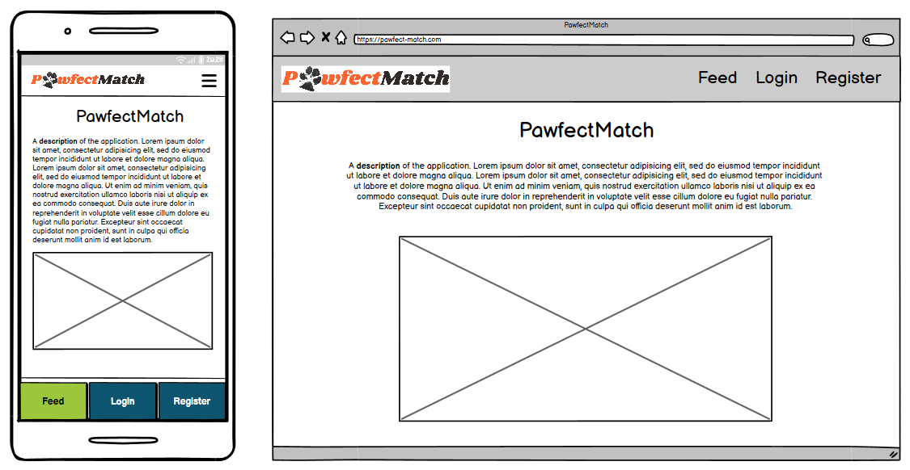
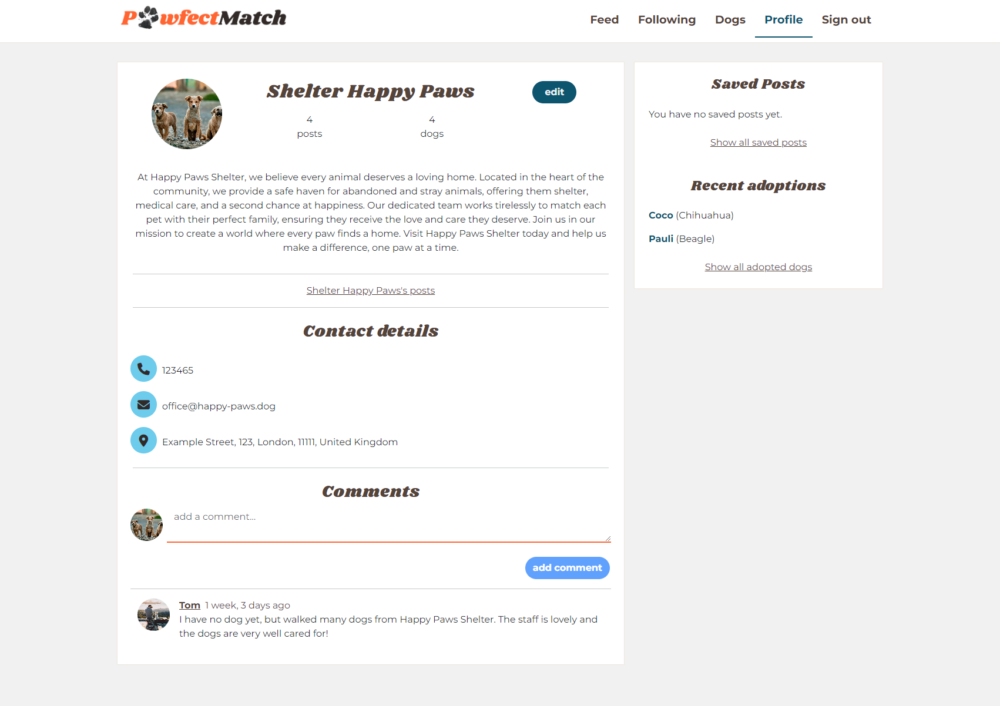
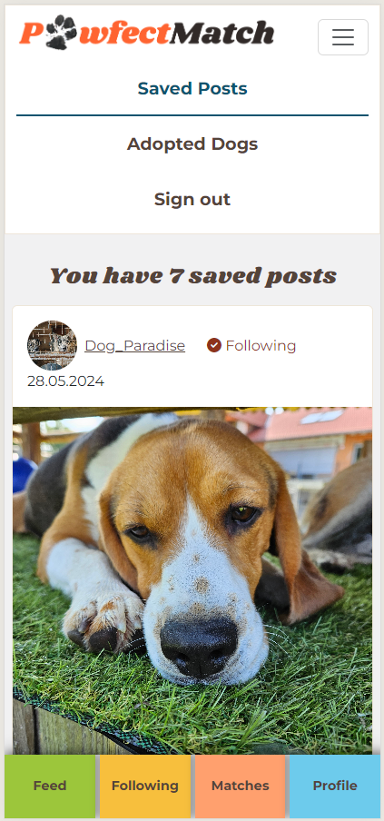

# **PawfectMatch**

PawfectMatch is a platform designed to connect dog shelters with prospective dog owners. Shelters can register, post details about their dogs, and share stories and photos, while future dog owners can register and search for their perfect match.

Here is the [link to the deployed project](https://pawfectmatch-60f883124db2.herokuapp.com/).

\
*Am I Responsive Screenshot*

# **Table of Contents**

<!-- TOC -->
* [**PawfectMatch**](#pawfectmatch)
* [**Table of Contents**](#table-of-contents)
* [**Planning**](#planning)
  * [**Strategy Plane**](#strategy-plane)
    * [**Target Audience**](#target-audience)
    * [**Site Goals**](#site-goals)
  * [**Scope Plane**](#scope-plane)
    * [**Necessary Features:**](#necessary-features)
    * [**Nice-to-have Features:**](#nice-to-have-features)
  * [**Structure Plane**](#structure-plane)
    * [**Epic: User Authentication**](#epic-user-authentication)
    * [**Epic: General UX**](#epic-general-ux)
    * [**Epic: Profile**](#epic-profile)
    * [**Epic: User Interaction**](#epic-user-interaction)
    * [**Epic: Posts**](#epic-posts)
    * [**Epic: Dog Posts**](#epic-dog-posts)
    * [**Epic: Notifications and Communication**](#epic-notifications-and-communication)
  * [**Skeleton Plane**](#skeleton-plane)
    * [**Wireframes**](#wireframes)
    * [**Database Schema**](#database-schema)
  * [**Surface Plane**](#surface-plane)
    * [**Design**](#design)
    * [**Colors and Fonts**](#colors-and-fonts)
    * [**Logo**](#logo)
* [**Agile Process**](#agile-process)
* [**Features**](#features)
  * [**User registration and login**](#user-registration-and-login)
  * [**Feed**](#feed)
  * [**Following**](#following)
  * [**Post CRUD**](#post-crud)
  * [**Profile**](#profile)
    * [**Comments**](#comments)
    * [**Edit profile**](#edit-profile)
  * [**Dogs**](#dogs)
    * [**Matches**](#matches)
  * [**Saved Posts and Recent Adoptions**](#saved-posts-and-recent-adoptions)
  * [**About Page**](#about-page)
  * [**Not found Page**](#not-found-page)
* [**Future Enhancements**](#future-enhancements)
* [**Testing**](#testing)
* [**Deployment**](#deployment)
* [**Packages and Frameworks**](#packages-and-frameworks)
* [**Credits**](#credits)
  * [**Acknowledgements**](#acknowledgements)
  * [**Content**](#content)
  * [**Media and Design**](#media-and-design)
<!-- TOC -->

# **Planning**

I structured my planning phase using the 5 UX planes - strategy, scope, structure, skeleton, and surface. The planning process was iterative. While gaining a better understanding of the project's scope, these planes evolved, creating a user-centered design for PawfectMatch.

## **Strategy Plane**

The idea for my PP5 is to create a platform to match shelter dogs with loving homes. Users can register as a shelter or adopter and find each other using filters.

### **Target Audience**

There are two target groups for this project with different needs and goals.

1. **Dog shelters** that want to use the application to find new homes for their dogs.
    - Shelters that want to reach more people and present themselves.
    - Shelters that want to have a point of reference for everyone interested in their dogs and adoption stories.
    - Shelters that want to find adopters based on the characteristics and needs of each dog.
2. **Individuals and families** that want to adopt a dog or are simply interested in dogs.
    - Adopters that are looking for a dog to adopt.
    - Adopters that want to have a closer look at a specific shelter before adopting a dog from them.
    - Dog lovers that are interested in the shelters work.
    - Dog lovers that want to read heartwarming stories about adopted dogs.

### **Site Goals**

- Build a platform for dog lovers.
- Connect shelters and adopters.
- Improve the adoption process by allowing to define criteria for each side.
    - Shelters can define the characteristics and needs for each dog.
    - Adopters give information about their housing situation and can look for dogs based on filters.
- Allow creating posts with multiple photos.
- Implement CRUD functionality.
- Make the application responsive, so it can be used on desktop, tablet and mobile screen sizes.

## **Scope Plane**

To get a better understanding of what the application will look like, I wrote down the features and sorted them into necessary and nice-to-have features.

### **Necessary Features:**

- Shelters can register and login.
- Adopters can register and login.
- Users (shelters and adopters) can fill out a profile.
- Profiles can be edited.
- Posts with pictures can be created, edited and deleted.
- Posts for dogs get a special flag, to be able to filter for dogs.
- Adopters can search and filter for dogs using characteristics and location.
- Shelters can define characteristics for each dog. (breed, age, size,…)
- Dogs can be marked as adopted.

### **Nice-to-have Features:**

- Profiles can be deactivated/deleted.
- Users can follow each other.
- Have a match functionality where dogs are suggested to adopters based on filtering.
- Comments for all user profiles.
- Messaging/chat with notifications.

## **Structure Plane**

From the features defined above I was able to create epics and break these down into user stories.

### **Epic: User Authentication**

| User Story                                                                                                                              | Priority       |
|-----------------------------------------------------------------------------------------------------------------------------------------|----------------|
| As a **new user**, I want to **register to the application**, so that I can **create posts**.                                           | **MUST HAVE**  |
| As an **existing user**, I want to **log in to the application**, so that I can **access my profile and posts**.                        | **MUST HAVE**  |
| As a **site user**, I want to **be able to see the feed without being logged in**, so that I can **decide whether I want to register**. | **MUST HAVE**  |

### **Epic: General UX**

| User Story                                                                                                                 | Priority        |
|----------------------------------------------------------------------------------------------------------------------------|-----------------|
| As a **site user**, I expect **a responsive design**, so that I can **use the application on various screen sizes**.       | **MUST HAVE**   |
| As a **site user**, I expect **clear and intuitive site navigation**, so that I can **easily navigate the application**.   | **MUST HAVE**   |
| As a **site user**, I expect **the application to be accessible**, so that **everyone can use it**.                        | **MUST HAVE**   |
| As a **site user**, I want to **contact the site owner**, so that I can **ask questions or report inappropriate content**. | **SHOULD HAVE** |

### **Epic: Profile**

| User Story                                                                                                           | Priority        |
|----------------------------------------------------------------------------------------------------------------------|-----------------|
| As a **shelter**, I want to **edit my profile**, so that I can **present myself to possible adopters**.              | **MUST HAVE**   |
| As an **adopter**, I want to **create and edit my profile**, so that I can **search for a new dog**.                 | **MUST HAVE**   |
| As a **site user**, I want to **deactivate my profile**, so that I can **show that I am unavailable at the moment**. | **COULD HAVE**  |

### **Epic: User Interaction**

| User Story                                                                                                           | Priority        |
|----------------------------------------------------------------------------------------------------------------------|-----------------|
| As a **site user**, I want to **follow other users**, so that I can **personalize my feed**.                         | **SHOULD HAVE** |
| As a **site user**, I want to **comment other profiles**, so that I can **share my opinions and experiences**.       | **COULD HAVE**  |

### **Epic: Posts**

| User Story                                                                                           | Priority        |
|------------------------------------------------------------------------------------------------------|-----------------|
| As a **site user**, I want to **create, edit, and delete posts**, so that I can **share stories**.   | **MUST HAVE**   |
| As a **site user**, I want to **add pictures to my posts**, so that I can **show the dogs**.         | **MUST HAVE**   |
| As a **site user**, I want to **save posts**, so that I can **find them again easily**.              | **SHOULD HAVE** |
| As a **site user**, I want to **have a personalized feed**, so that I can **find relevant content**. | **SHOULD HAVE** |

### **Epic: Dog Posts**

| User Story                                                                                                                 | Priority        |
|----------------------------------------------------------------------------------------------------------------------------|-----------------|
| As a **shelter**, I want to **create posts for dogs**, so that I can **show my dogs available for adoption**.              | **MUST HAVE**   |
| As a **shelter**, I want to **define adoption requirements for each dog**, so that I can **improve the adoption process**. | **COULD HAVE**  |
| As a **shelter**, I want to **mark a dog as adopted**, so that I can **show successful adoptions**.                        | **SHOULD HAVE** |
| As an **adopter**, I want to **search and filter for dogs**, so that I can **find the perfect dog for me**.                | **MUST HAVE**   |
| As an **adopter**, I want to **define my housing situation**, so that I can **match with dogs based on requirements**.     | **COULD HAVE**  |

### **Epic: Notifications and Communication**

| User Story                                                                                                            | Priority        |
|-----------------------------------------------------------------------------------------------------------------------|-----------------|
| As a **site user**, I want to **receive notifications**, so that I can **stay up-to-date**.                           | **COULD HAVE**  |
| As a **site user**, I want to **be able to use a chat**, so that I can **easily communicate with shelters/adopters**. | **COULD HAVE**  |

## **Skeleton Plane**

### **Wireframes**

I created wireframes for desktop and mobile screens for each of the main parts of the application.

    
<strong>About</strong>

    

    
<strong>Feed</strong>

    

    
<strong>Following</strong>

    

    
<strong>Matches</strong>

    

    
<strong>Profile</strong>

    

    
<strong>Post detail (Dog)</strong>

    

    
<strong>Shelter View</strong>

    

    
<strong>Mobile pages</strong>

    

### **Database Schema**

After defining the needed features for the application, I started creating my database schema. A detailed description of it and the final ERD for the finished API can be found in the [readme of the PawfectMatch API](https://github.com/Julia-Wagner/PawfectMatch-API?tab=readme-ov-file#database-schema).

\
*Database Schema for PawfectMatch*

## **Surface Plane**

### **Design**

My [PP2](https://github.com/Julia-Wagner/tails-and-treats) was also dog-themed and I really liked the colors and images I used there. So I decided to create a similar color scheme and use some of the icons and images again for this project.

### **Colors and Fonts**

I adapted the colors a little bit to have more possible color combinations with high enough contrast. I used [contrast-grid.eightshapes.com](https://contrast-grid.eightshapes.com/?version=1.1.0&background-colors=&foreground-colors=%23F1F1F2%0D%0A%23312A28%0D%0A%23EEE6D9%0D%0A%2354443A%0D%0A%230D546F%0D%0A%23FF6431%0D%0A%239CC63B%0D%0A%23F7BF3D%0D%0A%23FFA06E%0D%0A%236DCBEC%0D%0A&es-color-form__tile-size=regular&es-color-form__show-contrast=aaa&es-color-form__show-contrast=aa&es-color-form__show-contrast=aa18&es-color-form__show-contrast=dnp) to check the contrast and possible color combinations.

\
*Accessibility/contrast check for color scheme*

I will use the same fonts for this project as I used for my second project. **Shrikhand** for headings and **Montserrat** for text. The fonts pair nicely and the bold and playful shape of Shrikhand works good with my colors and the theme of the application.

### **Logo**

I created a logo for **PawfectMatch** using the paw print of my dog and the heading font.

\
*PawfectMatch Logo*

# **Agile Process**
I used a [GitHub Projects Board](https://github.com/users/Julia-Wagner/projects/4) to plan and document my work. The details of my agile approach can be found in the separate [AGILE.md file](AGILE.md).

# **Features**

## **User registration and login**

Users can register at **PawfectMatch** by filling out the *sign-up form*. A profile is automatically created for the user after registration. If a user selects the **Register as shelter** button, the profile gets the *type shelter*.

To use **PawfectMatch** as a live platform, a further step would be added to the registration to check if the user really is a shelter. This way I can avoid private breeders or people with bad intentions pretending to be a shelter. However, for this project, there will be no real shelters, so I added a simple button to be able to register as both profile types easily.

\
*Registration on a desktop*

\
*Registration as a shelter on a phone*

After successful registration, the user gets redirected to the *sign-in form*. If incorrect information is sent, error messages are shown in the forms.

\
*Login with error on a desktop*

## **Feed**

After successfully logging in, the users are redirected to the *feed*. This page is also available for unauthorized users. It shows all posts sorted by newest to oldest. Ten posts are loaded, if the user scrolls to the bottom of the page and there are more than ten posts, the next ten are loaded.

For each post, the profile that created the post is shown with the profile image and username. Logged-in users can follow and unfollow the profile or save and unsave the post. The content of the post is clipped after three lines and a link to view the full post is shown.

\
*Feed for an unauthorized user on a desktop*

\
*Feed on a phone*

## **Following**

The *Following* page is shown only for logged-in users. It renders posts like the feed, but only from profiles the user follows.

\
*Following page on a desktop*

## **Post CRUD**

Full CRUD functionality is implemented for posts. Logged-in shelter users can create posts and add a title, content and image to it. Dogs that are created by the logged-in shelter can also be linked to a post. 

For the content, I installed a WYSIWYG editor to allow more styling of the post. I installed the package *dompurify* to render the content safely and avoid security risks.

\
*Create a post on a desktop*

The owner of a post can edit or delete the post. For deletion, I added a confirm window to avoid unintentional deletion. 

\
*Update a post on a phone*

\
*Delete a post on a desktop*

The detail page of a post contains the whole content. If there are dogs linked to the post, they are shown underneath the content of the post.

\
*Post detail page*

## **Profile**

A profile is automatically created for a user after registration. User profiles can be viewed by everyone, but only the owner of a profile can edit it. The profile detail page contains all details added by the user. Users can follow and unfollow other profiles. If the owner of the profile added a name, it is shown at the top of the profile. If not, the username is visible there.

\
*Profile detail page on a phone*

A link to all created posts is added if the user is a shelter. 

### **Comments**

Comments can be added to profiles and are shown at the bottom of the profile page.

\
*Profile detail page of a shelter*

A comment can be edited or deleted by the person who created it.

\
*Edit a comment on a phone*

Banned words can be defined in the admin panel. Comments are checked before posting them to ensure they do not contain a banned word.

\
*Trying to comment a banned word*

### **Edit profile**

Each user can change their name, description, country and profile image. Only shelters are allowed to add an exact address, phone number and mail address.

\
*Profile edit shelter on a desktop*

\
*Profile edit adopter on a phone*

## **Dogs**

Only shelters can create dogs. They have a link in the navbar that takes them to the *Dogs* page. There all dogs that the logged-in shelter created are shown and they see a button to create a new dog.

\
*Dogs page on a desktop*

To create a dog, the name, breed, birthday, size and gender of the dog have to be added. Additionally, a description can be added using the WYSIWYG editor and characteristics can be chosen for the dog. A main image, a video and additional images can be uploaded for dogs.

\
*Create a do on a desktop*

The detail page of a dog includes the main image, name and description of the dog. Additional information and characteristics of the dog are rendered using icons and colorful tags. If additional images have been uploaded, they are shown in a slideshow. If a video was uploaded, it is shown under the slideshow.

At the bottom of the dog detail page, the contact information of the shelter and posts where this dog is linked are shown.

\
*Dog detail page on a phone*

\
*Dog detail page on a desktop*

\
*Dog detail page with a video on a phone*

### **Matches**

Adopters do not see the *Dogs* page, instead they have the *Matches* page. This page includes all dogs that are available for adoption. On top of the page, there is a filter to filter the matches by size, gender or characteristics of the dog.

The results load immediately after changing the filter. The button *Reset all filters* closes the filter and shows all dogs again.

\
*Matches page with filter on a desktop*

## **Saved Posts and Recent Adoptions**

Posts can be saved and unsaved. On bigger screens, the five most recently saved posts are listed and linked in the sidebar. There is also a link to a separate page with all saved posts. For mobile screens, the saved posts can be found on this separate page.

\
*Saved posts on a desktop*

The number of saved posts is shown at the top of the page. The page as well as the sidebar reload when saving or unsaving a post, so they are always up-to-date.

\
*Saved posts on a phone*

Recently adopted dogs are also shown in the sticky sidebar on bigger screens and on an additional page for smaller screens. The page includes all dogs that are marked as adopted.

## **About Page**

When clicking the logo in the navbar, the user is redirected to the about page. This includes information about **PawfectMatch** and contact details.

\
*About page*

## **Not found Page**

If a page that does not exist is opened, the *Not found page* is shown.

\
*Not found page*

# **Future Enhancements**

After extensive testing and getting feedback from testers, I can say that the project is ready to be used as a real-world application.

I have some user stories left that I marked as *won´t have* for the first release of the project. These might be implemented for future releases as enhancements of the application. The future features are:
  
  - **Deactivating a profile** - Users can deactivate and hide their profiles. They can reactivate it any time to be shown in the application again.
  - **Notifications** - Users get notifications and can mark these as read.
  - **Chat** - Create an in-app chat for adopters to chat with shelters.

Another user story I marked as *won´t have* is defining adoption requirements for a dog. I decided to drop this completely and not plan it for future versions either. The reason for this is that while developing and testing the application, I started to think that it would be too complicated for users to add additional requirements. For many dogs these would not be necessary and if there are special requirements they can be added manually to the description of the dog and be discussed directly between the shelter and possible adopters.

# **Testing**

Please refer to the separate [TESTING.md](TESTING.md) file.

# **Deployment**

Here is the [link to the deployed project](https://pawfectmatch-60f883124db2.herokuapp.com/). The deployment process for the API can be found [here](https://github.com/Julia-Wagner/PawfectMatch-API?tab=readme-ov-file#deployment).

1. **Create Repository**
    - The first step is to create a new empty repository. After creating the repository, you can open it in the IDE of your choice.

2. **Project Setup**
   - Create the **React App**:
       - `npx create-react-app . --use-npm`
       - run `npm start` to check the installation

3. **Heroku Setup**
   1. Log in to your [Heroku](https://www.heroku.com/) account
   2. On the dashboard click *New* - *Create new app*
   3. Give the app a unique name
   4. Select the region closest to you and click *Create app*
   5. Select your created app and open the *Deploy* tab
   6. Connect your GitHub repository and click *Deploy Branch* at the bottom of the page.

# **Packages and Frameworks**

- [react-bootstrap](https://react-bootstrap.netlify.app/) - to use Bootstrap components.
- [react-router-dom](https://www.npmjs.com/package/react-router-dom) - for routing.
- [axios](https://www.npmjs.com/package/axios) - to connect the frontend with the API.
- [react-infinite-scroll-component](https://www.npmjs.com/package/react-infinite-scroll-component) - to implement infinite scrolling for posts.
- [jwt-decode](https://www.npmjs.com/package/jwt-decode) - for unauthorized errors.
- [quill](https://quilljs.com/docs/quickstart) - the WYSIWYG editor.
- [dompurify](https://www.npmjs.com/package/dompurify) - to prevent security issues from HTML in content.

# **Credits**

## **Acknowledgements**

- Thank you to my Code Institute Mentor [Richard Wells](https://github.com/D0nni387) for giving me valuable feedback and tips during this project.

## **Content**

- I used the walkthrough projects from Code Institute as a general reference for the project.
- ChatGPT was used for content creation for post, profile and comment texts.

## **Media and Design**

- [Lucidchart](https://lucid.app/lucidchart/82318076-4a7b-4349-b6c6-c66c1f0d098e/edit?viewport_loc=0%2C-7%2C1462%2C1135%2C0_0&invitationId=inv_1c1b2e93-1683-407e-a6be-9134e668b788) was used to create the Database Schema.
- I used [Balsamiq](https://balsamiq.com/) to create the wireframes.
- I used [contrast-grid.eightshapes.com](https://contrast-grid.eightshapes.com/?version=1.1.0&background-colors=&foreground-colors=%23F1F1F2%0D%0A%23312A28%0D%0A%23EEE6D9%0D%0A%2354443A%0D%0A%230D546F%0D%0A%23FF6431%0D%0A%239CC63B%0D%0A%23F7BF3D%0D%0A%23FFA06E%0D%0A%236DCBEC%0D%0A&es-color-form__tile-size=regular&es-color-form__show-contrast=aaa&es-color-form__show-contrast=aa&es-color-form__show-contrast=aa18&es-color-form__show-contrast=dnp) to check the contrast and possible color combinations..
- The screenshot at the top of this document was taken from [Am I Responsive?](https://ui.dev/amiresponsive?url=https://pawfectmatch-60f883124db2.herokuapp.com/).
- Most of the dog images are from my own dogs, I used [unsplash.com](https://unsplash.com/) for some profile and post images.
