# **Testing**

[Go back to the README](README.md)

## **Table of Contents**

<!-- TOC -->
* [**Testing**](#testing)
  * [**Table of Contents**](#table-of-contents)
  * [**Manual Testing**](#manual-testing)
    * [**iPhone Testing**](#iphone-testing)
  * [**User Story Testing**](#user-story-testing)
  * [**Accessibility Testing**](#accessibility-testing)
  * [**Lighthouse Testing**](#lighthouse-testing)
  * [**Validation**](#validation)
    * [**HTML Validation**](#html-validation)
    * [**CSS Validation**](#css-validation)
    * [**JavaScript and JSX Validation**](#javascript-and-jsx-validation)
  * [**Bugs and Fixes**](#bugs-and-fixes)
<!-- TOC -->

## **Manual Testing**

I started this project by setting everything up and deploying it right away. While developing new features, I tested them on the local version. After finishing and pushing features or parts of them, I tested them on the deployed project.

I always tested new input by entering incorrect information and trying to break it. This way I ensured correct error handling and feedback to the user.

I regularly tested the application in different browsers and devices, like my phone and tablet. Specific scenarios included:

  - Navigating through different pages to ensure smooth transitions.
  - Testing form submissions with both valid and invalid inputs. 
  - Verifying the responsiveness of the application on various screen sizes.

When I found a bug while testing on my phone, I created a **Bug Issue** on my Kanban board and provided details and screenshots. After finishing all my *must have* user stories for the MVP, I did a first big round of testing.

The *#peer-code-review* channel on Code Institute´s Slack was used to get some feedback from other students. I also sent the link to my project to friends and family asking them to test it.

I tested to a minimum screen width of **300px** and a maximum screen width of **3440px** with my monitor. To test **Safari** and **iOS devices** I used [BrowserStack](https://www.browserstack.com/).

### **iPhone Testing**

While testing on BrowserStack, I noticed that cookies are not set on some iPhones and also when using an incognito browser. I spent some time reviewing the issue and then used tutor support. 

There I got the information, that this is a known issue and can be solved by allowing *third-party cookies* in the browser settings. The issue is described [here](https://code-institute-room.slack.com/archives/C02MTH5MBDG/p1659719243446449?thread_ts=1659705919.570999&cid=C02MTH5MBDG). As it is a known issue described by Code Institute, I decided to mark the bug as resolved for me. And continue testing with the needed browser settings.

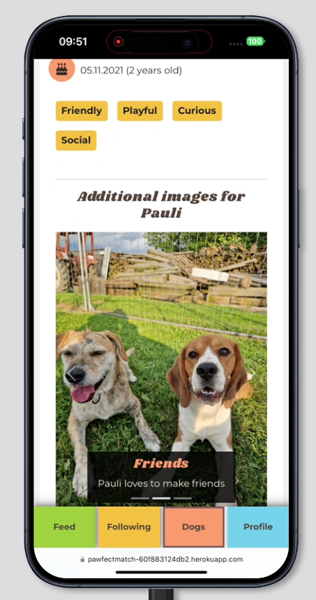\
*BrowserStack testing iPhone*

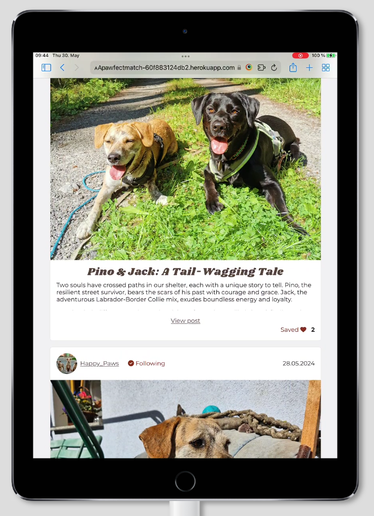\
*BrowserStack testing iPad*

## **User Story Testing**

| Testing setup                      | Passed all implemented user story tests |
|------------------------------------|-----------------------------------------|
| Monitor (3440px screen width)      | &check;                                 |
| Laptop (Google Chrome)             | &check;                                 |
| Laptop (Mozilla Firefox)           | &check;                                 |
| Laptop (Microsoft Edge)            | &check;                                 |
| Laptop (Safari - via BrowserStack) | &check;                                 |
| Tablet (Samsung)                   | &check;                                 |
| iPad (via BrowserStack)            | &check;                                 |
| Phone (Samsung Galaxy S23)         | &check;                                 |
| iPhone (via BrowserStack)          | &check;                                 |

In order for the **Acceptance Criteria met** to be ticked, every criterion specified in the linked project issue has to be fulfilled.

| User Story                                                                                                                              | Link to Acceptance Criteria                                     | Acceptance Criteria met                |
|-----------------------------------------------------------------------------------------------------------------------------------------|-----------------------------------------------------------------|----------------------------------------|
| As a **new user**, I want to **register to the application**, so that I can **create posts**.                                           | [link](https://github.com/Julia-Wagner/pawfect-match/issues/18) | &check;                                |
| As an **existing user**, I want to **log in to the application**, so that I can **access my profile and posts**.                        | [link](https://github.com/Julia-Wagner/pawfect-match/issues/19) | &check;                                |
| As a **site user**, I want to **be able to see the feed without being logged in**, so that I can **decide whether I want to register**. | [link](https://github.com/Julia-Wagner/pawfect-match/issues/20) | &check;                                |
| As a **site user**, I expect **a responsive design**, so that I can **use the application on various screen sizes**.                    | [link](https://github.com/Julia-Wagner/pawfect-match/issues/21) | &check;                                |
| As a **site user**, I expect **clear and intuitive site navigation**, so that I can **easily navigate the application**.                | [link](https://github.com/Julia-Wagner/pawfect-match/issues/22) | &check;                                |
| As a **site user**, I expect **the application to be accessible**, so that **everyone can use it**.                                     | [link](https://github.com/Julia-Wagner/pawfect-match/issues/23) | &check;                                |
| As a **site user**, I want to **contact the site owner**, so that I can **ask questions or report inappropriate content**.              | [link](https://github.com/Julia-Wagner/pawfect-match/issues/24) | &check;                                |
| As a **shelter**, I want to **edit my profile**, so that I can **present myself to possible adopters**.                                 | [link](https://github.com/Julia-Wagner/pawfect-match/issues/25) | &check;                                |
| As an **adopter**, I want to **create and edit my profile**, so that I can **search for a new dog**.                                    | [link](https://github.com/Julia-Wagner/pawfect-match/issues/26) | &check;                                |
| As a **site user**, I want to **deactivate my profile**, so that I can **show that I am unavailable at the moment**.                    | [link](https://github.com/Julia-Wagner/pawfect-match/issues/27) | Feature not included for first release |
| As a **site user**, I want to **follow other users**, so that I can **personalize my feed**.                                            | [link](https://github.com/Julia-Wagner/pawfect-match/issues/28) | &check;                                |
| As a **site user**, I want to **comment other profiles**, so that I can **share my opinions and experiences**.                          | [link](https://github.com/Julia-Wagner/pawfect-match/issues/29) | &check;                                |
| As a **site user**, I want to **create, edit, and delete posts**, so that I can **share stories**.                                      | [link](https://github.com/Julia-Wagner/pawfect-match/issues/30) | &check;                                |
| As a **site user**, I want to **add pictures to my posts**, so that I can **show the dogs**.                                            | [link](https://github.com/Julia-Wagner/pawfect-match/issues/31) | &check;                                |
| As a **site user**, I want to **save posts**, so that I can **find them again easily**.                                                 | [link](https://github.com/Julia-Wagner/pawfect-match/issues/32) | &check;                                |
| As a **site user**, I want to **have a personalized feed**, so that I can **find relevant content**.                                    | [link](https://github.com/Julia-Wagner/pawfect-match/issues/33) | &check;                                |
| As a **shelter**, I want to **create posts for dogs**, so that I can **show my dogs available for adoption**.                           | [link](https://github.com/Julia-Wagner/pawfect-match/issues/34) | &check;                                |
| As a **shelter**, I want to **define adoption requirements for each dog**, so that I can **improve the adoption process**.              | [link](https://github.com/Julia-Wagner/pawfect-match/issues/35) | Feature not included for first release |
| As a **shelter**, I want to **mark a dog as adopted**, so that I can **show successful adoptions**.                                     | [link](https://github.com/Julia-Wagner/pawfect-match/issues/36) | &check;                                |
| As an **adopter**, I want to **search and filter for dogs**, so that I can **find the perfect dog for me**.                             | [link](https://github.com/Julia-Wagner/pawfect-match/issues/37) | &check;                                |
| As an **adopter**, I want to **define my housing situation**, so that I can **match with dogs based on requirements**.                  | [link](https://github.com/Julia-Wagner/pawfect-match/issues/38) | Feature not included for first release |
| As a **site user**, I want to **receive notifications**, so that I can **stay up-to-date**.                                             | [link](https://github.com/Julia-Wagner/pawfect-match/issues/39) | Feature not included for first release |
| As a **site user**, I want to **be able to use a chat**, so that I can **easily communicate with shelters/adopters**.                   | [link](https://github.com/Julia-Wagner/pawfect-match/issues/40) | Feature not included for first release |

## **Accessibility Testing**

I tested my application using the [WAVE tool](https://wave.webaim.org/) to ensure good accessibility. It returned no errors for all pages of the application.

The returned alerts are because of *redundant alternative text* and *redundant links*. That is the case, because all posts include the profile picture and link to the profile and these are the same if multiple posts are shown from the same profile.

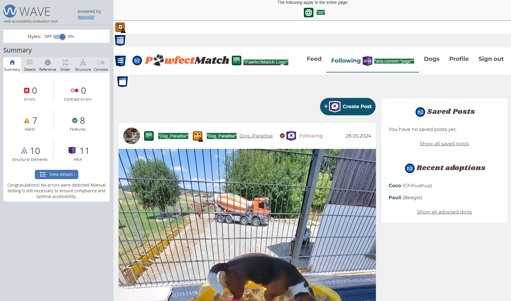\
*WAVE result for Stock Items*

## **Lighthouse Testing**

I ran Lighthouse for mobile and desktop regularly while developing new features. For the final testing, I ran it again on every page of the application.

The value for **SEO** is *100* on all pages. 

For **Accessibility** it is *100* on some, but lower on others. The reason for this is *redundant alt text*. However, that is because the profile images have the username of the profile as the alt text. So if more than one post by the same profile is visible, the same image with the same alt text is showing multiple times.

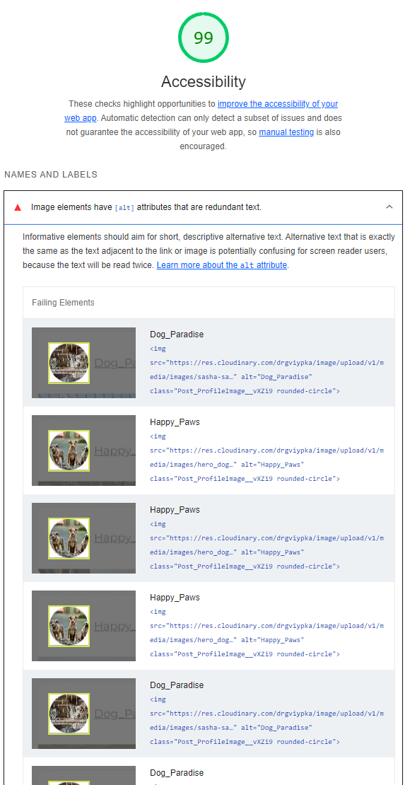\
*Lighthouse Accessibility result*

For **Best Practices** the value is not *100* because of two reasons. When I am logged out, I have three error logs in the console. These are supposed to be here as explained in the Moments walkthrough. However, Lighthouse treats errors logged to the console as a problem.

The other reason is that third-party cookies are used when I am logged in, which also decreases the value.

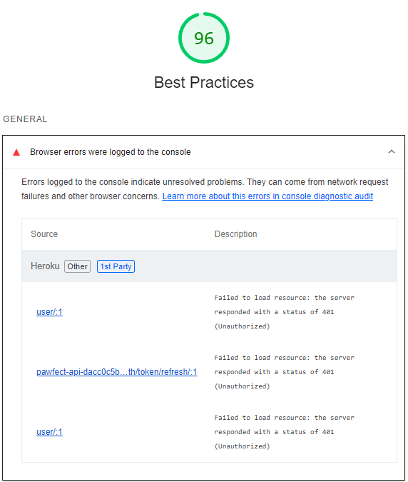\
*Lighthouse Best Practices result*

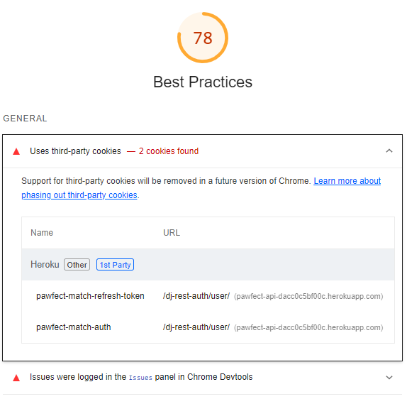\
*Lighthouse Best Practices result Cookies*

The values for **Performance** where not very good in the beginning. I took several steps to improve my page speed:

  - On the **backend** I installed *django-resized* to automatically compress uploaded images and save them as *.webp*
  - On the **frontend** I tried to optimize the API requests by:
    - Reducing the number of requests
    - Fetching multiple resources concurrently
    - Avoiding unnecessary data fetching
    - Lazy loading components
    - Minimizing re-renders

The value for **Performance** varies depending on the device and time of the day but here are some values for the most important pages of the application. In general performance is better, when the user is logged-out. That is due to the necessary API requests for loading the saved posts and adopted dogs in the sidebar.

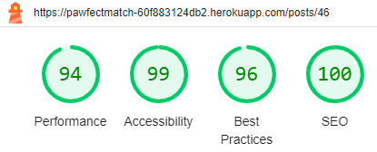\
*Lighthouse result post detail page (desktop)*

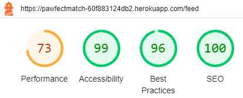\
*Lighthouse result feed (desktop)*

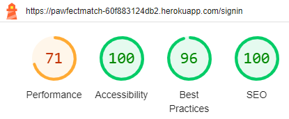\
*Lighthouse result sign in page (mobile)*

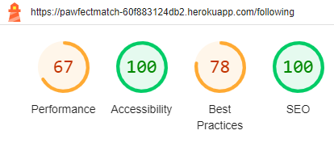\
*Lighthouse result following page (mobile)*

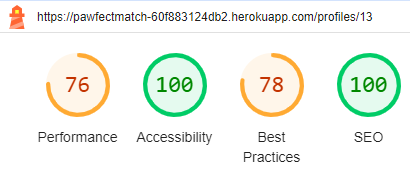\
*Lighthouse result profile page (desktop)*

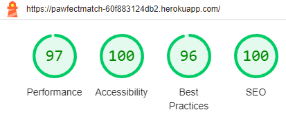\
*Lighthouse result about page (desktop)*

## **Validation**

### **HTML Validation**

I used the [HTML W3C Validator](https://validator.w3.org/) to validate my HTML code. However, that only valdiates the content of the *index.html* file. As the rest of the application is generated dynamically by React.

Therefore, I also validated the **JSX code** to ensure valid HTML.

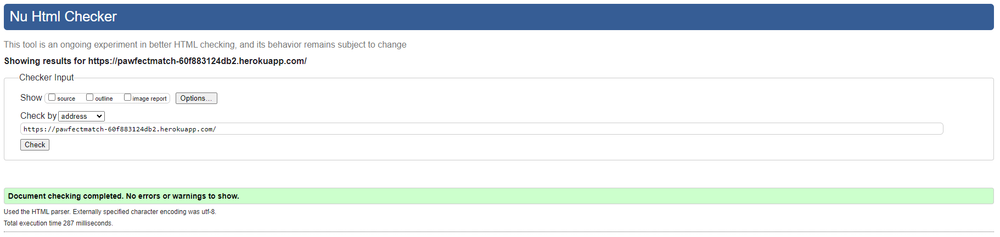\
*HTML validation result*

### **CSS Validation**

I used the [W3C CSS Validator](https://jigsaw.w3.org/css-validator/) to validate my custom CSS code, the CSS created by Bootstrap was not tested. My custom CSS code was validated without errors.

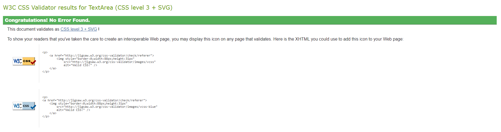\
*CSS validation result for custom CSS*

### **JavaScript and JSX Validation**

[ESlint](https://eslint.org/) was used in my code editor to test my JavaScript and JSX code. 

On the first run I got quite a few errors. However, most of them where because of missing prop-types. After defining them and fixing some other smaller issues, I have **no errors or warnings**.

The pretty-printed JSON result can be found [here](/docs/testing/eslint-results.pdf).

## **Bugs and Fixes**

When testing the application on my phone, or when I encountered bugs outside the current sprints' scope, I opened a **Bug issue** on my Kanban board.

Besides the adaptions and fixes already mentioned in the documentation, here are the Bugs I found. There are no known bugs that are not solved.

| Bug                                                                                                                         | Solved  | Bug Issue                                                                                                                                                                         | Fix Commit                                                                                                                              | Solution                                                                                                               |
|-----------------------------------------------------------------------------------------------------------------------------|---------|-----------------------------------------------------------------------------------------------------------------------------------------------------------------------------------|-----------------------------------------------------------------------------------------------------------------------------------------|------------------------------------------------------------------------------------------------------------------------|
| The sticky bottom nav is not at the bottom at the sign up page.                                                             | &check; | [Bug #1: Sticky bottom nav](https://github.com/Julia-Wagner/pawfect-match/issues/46)                                                                                              | [ac59356](https://github.com/Julia-Wagner/pawfect-match/commit/ac593569728112f62cf6c2c19ed223173c84a2dc)                                | I had to adapt the container height so the nav is pushed to the bottom of the page.                                    |
| After logging in, the navbar doesn´t immediately update. Only after reloading the page.                                     | &check; | [Bug #2: Nav update login](https://github.com/Julia-Wagner/pawfect-match/issues/47)                                                                                               | [5b18cab](https://github.com/Julia-Wagner/pawfect-match/commit/5b18cabdb5af9b9830240edf6f544fd88c9abbb9)                                | My mentor helped me find out that I was just missing curly braces at an API call.                                      |
| Logging in in an incognito tab is not possible.                                                                             | &check; | [Bug #3: Incognito Login](https://github.com/Julia-Wagner/pawfect-match/issues/48)                                                                                                | [Knwon issue](https://code-institute-room.slack.com/archives/C02MTH5MBDG/p1659719243446449?thread_ts=1659705919.570999&cid=C02MTH5MBDG) | As described above, this is a known issue and I decided to adapt browser settings to allow third-party cookies.        |
| For the additional images slider on the dog detail page there is always one more empty slide than there are images.         | &check; | [Bug #4: Additional Images Slider](https://github.com/Julia-Wagner/pawfect-match/issues/49)                                                                                       | [87ddad6](https://github.com/Julia-Wagner/pawfect-match/commit/87ddad6403489ef3319841ed3b55dd4e133a8c94)                                | I had the h3 inside the Carousel and it was treated as a child element.                                                |
| Additional images for dogs can´t be edited.                                                                                 | &check; | [Bug #5: Additional images edit](https://github.com/users/Julia-Wagner/projects/4/views/1?filterQuery=label%3Afrontend+milestone%3A%22Sprint+%2310%22&pane=issue&itemId=65320272) | [fa6c257](https://github.com/Julia-Wagner/pawfect-match/commit/fa6c25760ffe12117bd97011191ac85717f9a15a)                                | Instead of trying to update individual images, I allow the user to delete uploaded additional images and add new ones. |
| The sidebar is not visible for tablet screen size, but the mobile menu with the sidebar is not visible at this size either. | &check; | [Bug #6: Sidebar not visible](https://github.com/Julia-Wagner/pawfect-match/issues/51)                                                                                            | [46a991c](https://github.com/Julia-Wagner/pawfect-match/commit/46a991c67b27a3a5e4c6827e48256d2c350cf7e1)                                | I used the mobile navbar withour the Sidebar for medium screen sizes.                                                  |
| The truncate style for posts does not work on safari.                                                                       | &check; | [Bug #7: Post Truncate Safari](https://github.com/Julia-Wagner/pawfect-match/issues/52)                                                                                           | [c3e4a42](https://github.com/Julia-Wagner/pawfect-match/commit/c3e4a424356cf8ca7929216e4f10ba7b3b5b065f)                                | I adapted the CSS class to work for safari.                                                                            |
